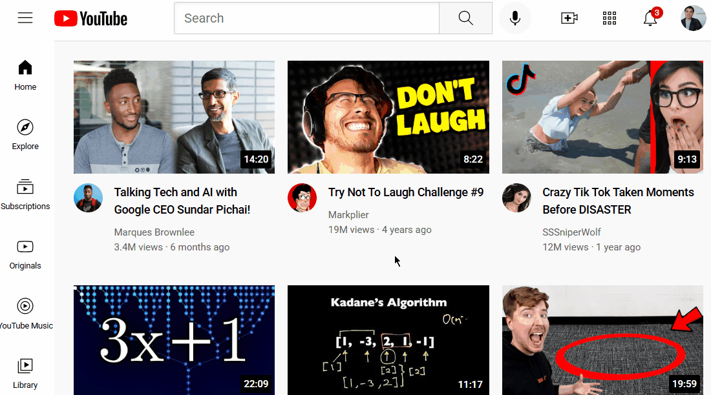

# 📺 Youtube-Homepage-Replica

# 📺 YouTube Homepage Replica

A front-end clone of the YouTube homepage using **only HTML and CSS**. This responsive project mimics YouTube’s layout — including a header, sidebar, video grid, and channel interactions — all without JavaScript.

---

## 🌟 Features

- 🎯 Pixel-perfect replica of YouTube homepage UI
- 🧠 Pure HTML and CSS — no frameworks or JS
- 📱 Responsive video grid layout
- 🎥 Hover effect on channel profile shows subscriber count
- 💡 Organized file structure for scalability

---

## 👆 Hover Effect (CSS-only)

A unique addition:  
> Hover over any **channel profile picture** to reveal a **channel card** with:
- ✅ Channel display image  
- ✅ Channel name  
- ✅ Subscriber count  



---

## 📸 Full Page Preview


---

## 🚀 Getting Started

1. Clone the repository or download ZIP
2. Open `youtube.html` in any browser

```bash
git clone https://github.com/yourusername/Youtube-Homepage-Replica.git
cd Youtube-Homepage-Replica
start youtube.html


